# JKU-CloudComputing-WS20_21 
Repository for the course Cloud Computing at the JKU in the winter semester 2020/2021

# Demo Application

Main Parts of Flux Demo:

https://github.com/paust/fleet.git  
https://github.com/paust/prod.git  
https://github.com/paust/stage.git  
https://github.com/paust/podinfo.git   
https://github.com/vfarcic/devops-toolkit.git  

## overview
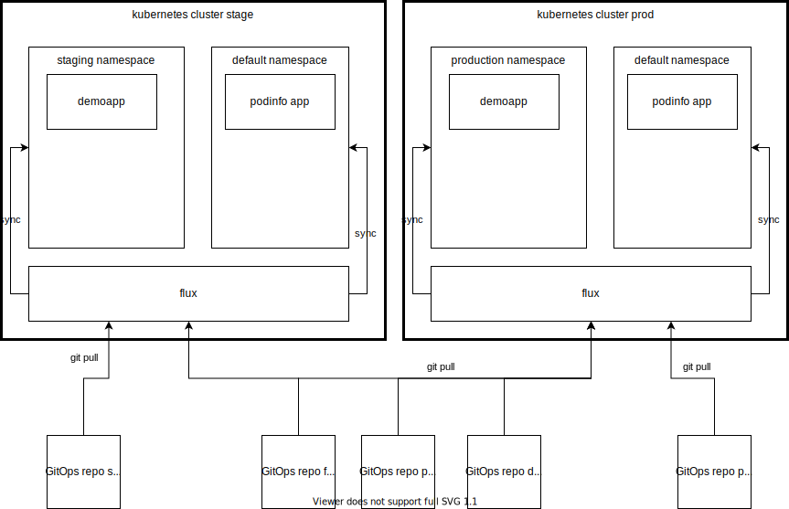 

## Fleet repo  

The fleet repo is responsible for the configuration of flux on the cluster. Here are the repos defined which should be watched, and which Kustomizations should be applied on the Cluster. 

## Podinfo  

The podinfo repo is a fork from https://github.com/stefanprodan/podinfo.git and adopted for our need to work with two environments.  
The Kusomization from the Fleet repo points to the desired Overlayfolder with the actual active Environment.

## devops-toolkit
The devops-toolkit repo is a demo application from Viktor Farcic where some helm releases are configured.

The prod and the stage repo are configuring the helm versions for the applications on the staging and production evnironments.
These two configuration repos only make sense where helm releases are used to deploy the applications.

## Versioning stragegies for podinfo and devops-toolkit applications

### devops-toolkit  
The devops-toolkit is versioned using helm charts. Which versioin sould be applied to the cluster is configured in the prod/stage repos. The versioning of the app is done in the demo app itself. Pro: the Versioning of the running app in the cluster does not infere the history of the app itself. Con: Each environment needs its own repo for configuration purposes.

### podinfo
 The podinfo applications uses Kustomizations to configure the cluster. The configuration files and the source files are in the same repo. So configuration and the application can not be modified independently. For eg using version 1.2 for the app and version 1.5 for the configuration.... 

# General Structure of the fleet repo
 
-  clusters/stage/flux-system/      generated Directory of the flux system by the bootstrapping process
-  clusters/stage/app_podinfo.yaml      Kustomization podinfo with the link to configurationpath from the repo_podinfo_source         
-  clusters/stage/repo_demo.yaml    ResoucePath to the demoapplication Repository
-  clusters/stage/repo_podinfo.yaml         ResoucePath to the podinfoapplication Repository
-  clusters/stage/repo-stage-source.yaml    ResoucePath to this repo itself   
-  clusters/stage/stage-kustomization.yaml   EntryPoint to the kustomization for the staging environment for the deomapplication 

The demoapplication configuration path:  
-> flux-system/kustomization.yaml -> stage-kustomization.yaml -> :stage: app_demo.yaml  

The podinfo configuration path:  
-> flux-system/kustomization.yaml -> app_podinfo.yaml -> :podinfo: /kustomize/app/env/stage/kustomization.yaml + overlay replica_count.yaml  

:stage: stage repo  
:podinfo: podinfo repo  

# Bootstrapping  

flux bootstrap github  
	--owner=$GITHUB_USER --repository=fleet  
	--branch=main   
	--path=./clusters/stage    

    
results in  

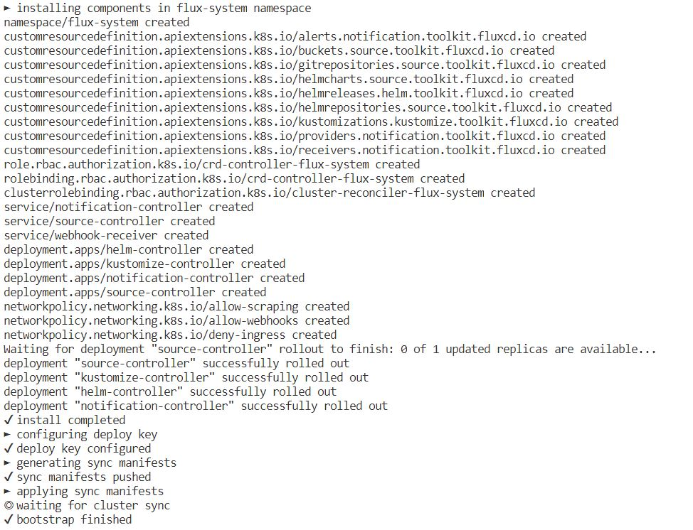

## Testing the results 

### running pods:   
kubectl get pods -n default  
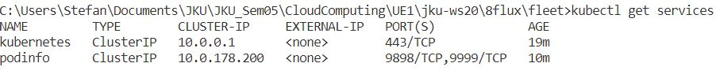  

pods on the staging namespace  
kubectl get pods -n staging   
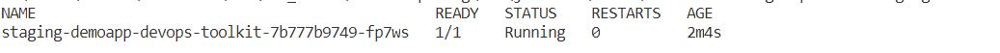

### running services:  
services on the default namespace  
kubectl get services  

services on the staging namespace  
kubectl get services -n staging  

### flux output:  
all helm releases  
flux get helmreleases  

all git sources  
flux get sources git  
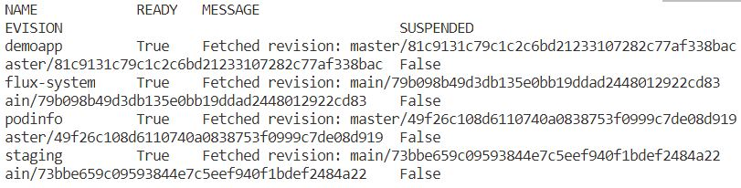

all kustomizations  
flux get kustomizations  
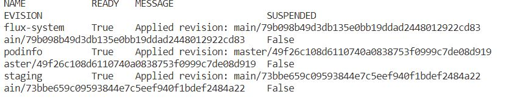

lets have a try:  

kubectl port-forward -n staging service/staging-demoapp-devops-toolkit 8081:80  
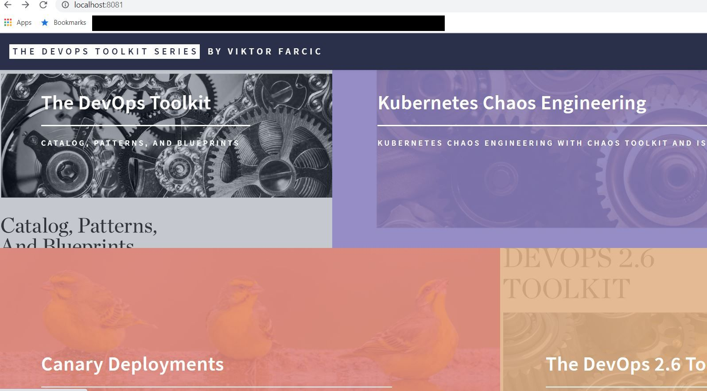

kubectl port-forward service/podinfo 8080:9898   
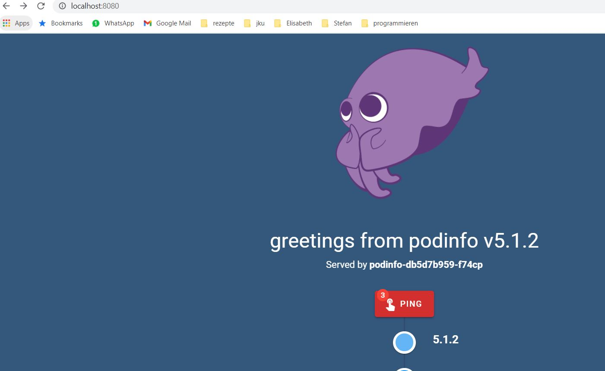

# Comparison Argo CD vs. Flux v2
## Basic functionality
The Basic functionality is the same. Both ArgoCD and Flux provide tools to connect to git repositories and sync the content with kubernetes clusters in a declarative way.
 The main difference between them is Flux allowing only to connect one repository per instance of Flux operator. ArgoCD on the other hand can connect multiple git repositories to one cluster.
 Multiple git repositories at one cluster are useful if multiple teams provide manifests for Kubernetes or if the application manifests should be stored together with the application code.

| Flux: | Argo CD: |
| ----- | -------- |
|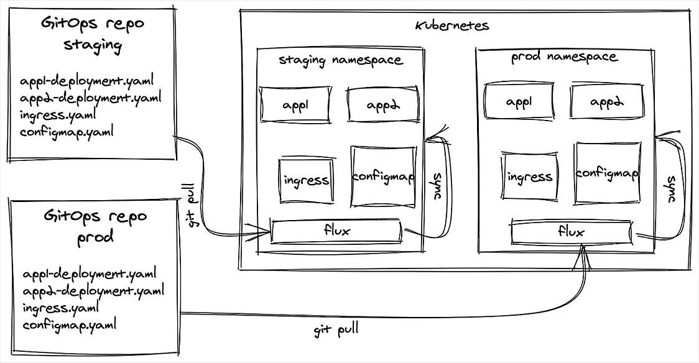|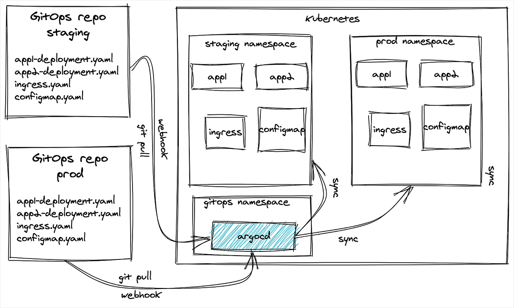|

## Clusters
The next difference is Flux working only inside the cluster like a typical Kubernetes Operator, managing only one cluster effectively. Meanwhile ArgoCD can manage multiple clusters with one instance, providing one centralized tool to manage all clusters from one place. It can sync the cluster it is running on as well as external clusters.

## GUI
Another big difference is ArgoCD providing a very nice graphical user interface to simplify monitoring the state of all applications. This includes the current state of the synchronization and the virtualisation of relations between objects in the app manifests.
 Flux on the other hand does not provide any graphical user interface. Instead there only exists an integration into the (paid) Weavework SaaS services.

## Enterprise readiness
If you plan to use one of the tools in enterprise solutions, ArgoCD may be the first choice. It features Single-Sign-On as well as builtin support for role based access control whereas Flux is limited to the Kubernetes role based access control, because it is just a controller.

## Manifest generation
ArgoCD and Flux both have the possibility to generate manifests, but ArgoCD includes more builtin support for tools like kustomize, helm and ksonnet. Own tools can be plugged into both.

## Updating container images
Where Flux shines is updating the container images automatically. This way, less critical containers can be updated to revision versions, without doing it manually. In ArgoCD the changes have to be committed to the git repository in order to update the container image.

## Argo FLux
Recently both tools joined together. They want to provide a single and best-in-class tool-chain for GitOps as well as a global-scale reference architecture for GitOps. The engineering resources to address issues and feature requests is doubled. The main advantage is the new Argo Flux dashboard joining the advantages of both tools. This way workflows and events will be used that leverage the beneficial features of Argo CD and Flux CD.
 In the process of merging the tools, the GitOps Engine will be created. It is used to share common components and provide backwards-compatibility for both Argo CD and Flux CD. It will manage the access to git repositories, Kubernetes resource caches, manifest generation, resource reconciliation and sync planning.

## Future steps of the Argo Flux project
* More efficient syncing
* Reduction of cluster API calls and etcd traffic
* Increased syncing frequency
* Advanced syncing features, including pre-post sync hooks and sync waves
* Overall performance and efficiency improvements

# Gitops tools included in Github
Additional to the tools named below, it is possible to enable other integrations, manage keys for deployment, setup artifact and log retention, setup environments and manage secrets for accessing actions and codespaces and set temporary interaction limits.

## Github Review Process
To enforce a review process for pull requests, branch protection rules need to be added. These rules can target specific branches or can match branches with a defined pattern. For all branches matching the specified pattern, the following rules can be applied:

* Require pull request reviews before merging (Including the number of required approvals)
  * Dismiss stale pull request approvals when new commits are pushed 
  * Require review from Code Owners 
* Require status checks to pass before merging 
  * Require branches to be up to date before merging 
  * Select Status checks that are required
* Require signed commits 
* Require linear history 
* Include administrators 
* Allow force pushes (Permit force pushes for all users with push access.)
* Allow deletions (Allow users with push access to delete matching branches. )

To test the review process, I created the pattern “main” to apply the rule to our main branch. I enforced that at least one person needs to approve the pull request. Additionally I checked that the rule includes administrators, because I am an administrator of the repository and could not test the rule if it does not apply to me.
 After creating the rule, it is not possible to push to the main branch without at least one approval of my team members.
 In the Settings->Options tab it is possible to allow auto-merge. In this case, pull requests with the needed approval are merged automatically. I enabled this option together with automatically deleting head branches after the pull request is merged.

### Result of the implementation of the request approval
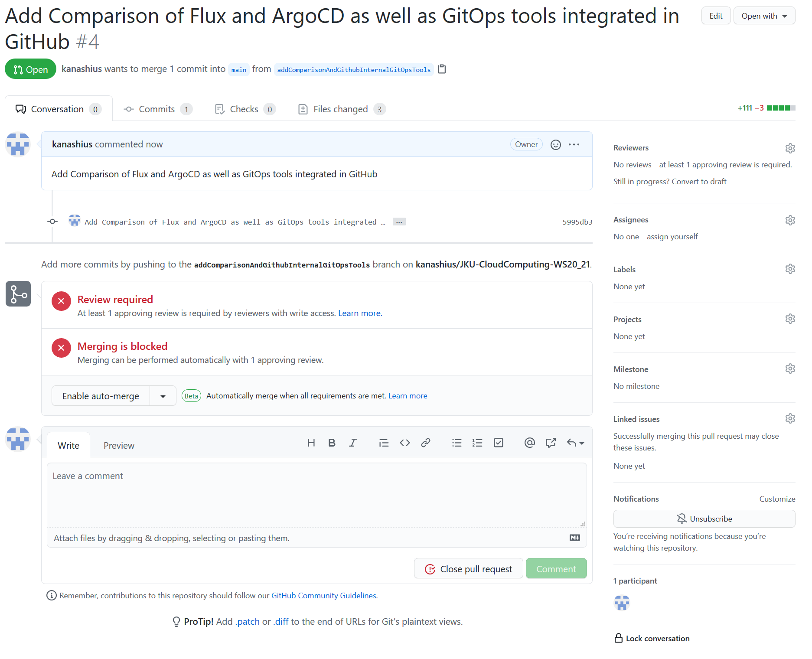

## Webhooks
Webhooks can be used to notify other tools that changes to the repository were made. This is done with POST requests to defined urls. It can be send as JSON or x-www-form-urlencoded and may contain a secret.
 The type of Event can be defined, too. Available options are just push events, everything or the manual selection of the events.

| Event                                 | Description            |
| ------------------------------------- | ---------------------- |
| Branch or tag creation				| Branch or tag created. |
| Branch or tag deletion				| Branch or tag deleted. |
| Check runs							| Check run is created, requested, rerequested, or completed. |
| Check suites							| Check suite is requested, rerequested, or completed. |
| Code scanning alerts					| Code Scanning alert created, fixed in branch, or closed |
| Collaborator add, remove, or changed	| Collaborator added to, removed from, or has changed permissions for a repository. |
| Commit comments						| Commit or diff commented on. |
| Deploy keys							| A deploy key is created or deleted from a repository. |
| Deployment statuses					| Deployment status updated from the API. |
| Deployments							| Repository was deployed or a deployment was deleted. |
| Forks									| Repository forked. |
| Issue comments						| Issue comment created, edited, or deleted. |
| Issues								| Issue opened, edited, deleted, transferred, pinned, unpinned, closed, reopened, assigned, unassigned, labeled, unlabeled, milestoned, demilestoned, locked, or unlocked. |
| Labels								| Label created, edited or deleted. |
| Meta									| This particular hook is deleted. |
| Milestones							| Milestone created, closed, opened, edited, or deleted. |
| Package v2s							| GitHub Packages published or updated in a repository. |
| Packages								| GitHub Packages published or updated in a repository. |
| Page builds							| Pages site built. |
| Project cards							| Project card created, updated, or deleted. |
| Project columns						| Project column created, updated, moved or deleted. |
| Projects								| Project created, updated, or deleted. |
| Pull request review comments			| Pull request diff comment created, edited, or deleted. |
| Pull request reviews					| Pull request review submitted, edited, or dismissed. |
| Pull requests							| Pull request opened, closed, reopened, edited, assigned, unassigned, review requested, review request removed, labeled, unlabeled, synchronized, ready for review, converted to draft, locked, unlocked, auto merge enabled, or auto merge disabled. |
| Pushes								| Git push to a repository. |
| Registry packages						| Registry package published or updated in a repository. |
| Releases								| Release created, edited, published, unpublished, or deleted. |
| Repositories							| Repository created, deleted, archived, unarchived, publicized, privatized, edited, renamed, or transferred. |
| Repository imports					| Repository import succeeded, failed, or cancelled. |
| Repository vulnerability alerts		| Security alert created, resolved, or dismissed on a repository. |
| Secret scanning alerts				| Secrets scanning alert created, resolved, or reopened |
| Stars									| A star is created or deleted from a repository. |
| Statuses								| Commit status updated from the API. |
| Team adds								| Team added or modified on a repository. |
| Visibility changes					| Repository changes from private to public. |
| Watches								| User stars a repository. |
| Wiki									| Wiki page updated. |

### Result of the implementation of the webhook
I created a php page, where the requests of the webhook are send. This page stored them in a textfile. Another file is used to display the results. 
I removed the webpage for receiving notifications because of security reasons, but the page showing the results is available here: 
[Some Webrequest data](http://kanashius.ddns.net/cloudComputingJKU/cloudComputingJKU.php) 
The data send to the website could be used to trigger other actions at the server.

## Notifications
Enable email notifications for push events, sending an email to one or more email addresses.

## Actions
Another tool are Actions. They are used for automated builds, tests and deployment. It can be defined, who can execute actions and self-hosted runners to execute the actions can be added.
